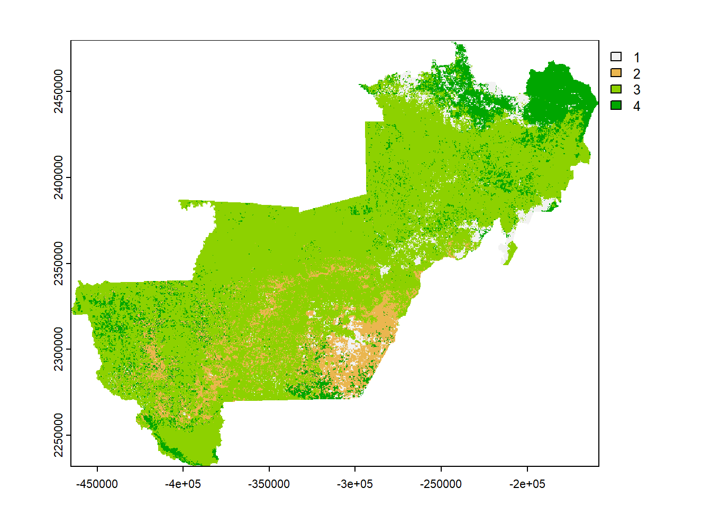
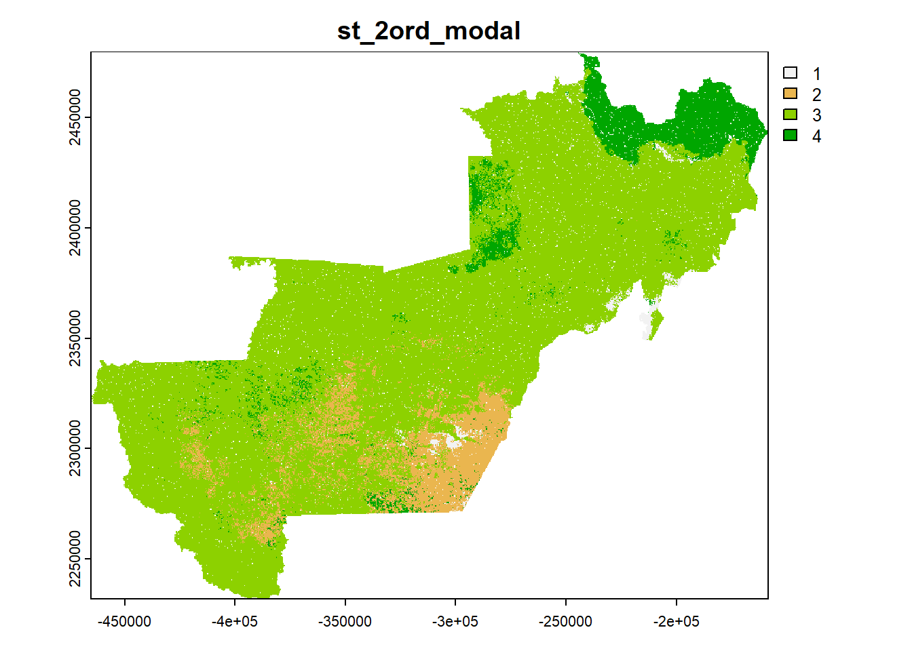
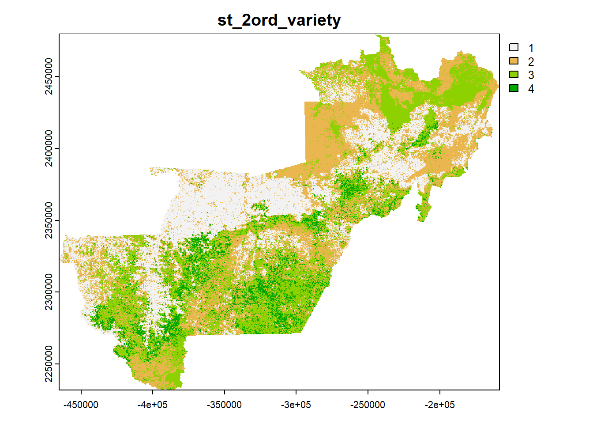

## Loading packages
```{r message=FALSE, warning=FALSE}
pkg <- c("dplyr", "caret", "randomForest", "e1071", "ggplot2", "doParallel", "tidyr", "stringr", "parallelly", "quantregForest", "parallel", "terra", "data.table", "sf")

sapply(pkg, require, character.only = T)
```


## Cleaning the environment (removing objects and previously loaded packages)
```{r message=FALSE, warning=FALSE}
rm(list = ls())  
gc()
```

# Loading rasters os predictors
```{r message=FALSE, warning=FALSE}
lr <- list.files(path = "./predictors/full", pattern = ".tif$",
                 full.names = T) %>% 
  rast()


r_base <- lr %>% 
  subset("dem")
```


## Creating a integer code for classes
```{r message=FALSE, warning=FALSE}
df <- read.csv2("./classification/extract_xy/class_yx.csv") %>% 
  select(st_2ord) %>% 
  mutate(st_2ord = as.factor(sort(st_2ord))) %>% 
  distinct(st_2ord) %>% 
  mutate(code = unclass(st_2ord)) %>% 
  relocate(code)


write.csv2(df, file = "./classification/df_st_2ord.csv", row.names = F)

```


## Loading models and names os predictors 
```{r message=FALSE, warning=FALSE}
load("./classification/results/rf/st_2ord/img/st_2ord.RData")

code_cla <- read.csv2("./classification/df_st_2ord.csv")

varfact <- c("curvature_classification", "geology", "geomorphons", "landforms_tpi_based", "surface_specific_points", "rookeries", "terrain_surface_classification_iwahashi", "valley_idx", "vegetation") %>% sort()
```


## Prediction of the 100 rasters
```{r eval=FALSE, message=FALSE, warning=FALSE, include=TRUE}
source("./scripts/s_fpredict_rst_class.R")

for (i in seq_along(lmodel)) {
  t1 <- Sys.time()
  
  rst <- predict_clas(lrst = lr,
                      model = lmodel[[i]],
                      nm_rst = "st_2ord",
                      nm_subset = lrfepred[[i]],
                      df_code = code_cla,
                      crs = "ESRI:102015",
                      varfact = varfact)
  
  
  if (!file.exists(paste0("./classification/results/rf/st_2ord/raster"))) {
    
    dir.create(paste0("./classification/results/rf/st_2ord/raster"))
    
  } 
  
  
  
  if (!compareGeom(rst, r_base, stopOnError = F)){
    
    rst <- resample(rst, r_base, method = "near")
  }
  
  
  
  terra::writeRaster(rst, overwrite = T,
                     gdal = c("COMPRESS=LZW"),
                     filename = paste0("./classification/results/rf/st_2ord/raster/",
                                       names(rst),"_", i, ".tif"))
  print(paste("model", i, round(Sys.time() - t1, 2),
              units(Sys.time() - t1)))
  
  plot(rst, type = "classes", main = paste("model", i))
  
  
  gc()
}
```

<p align="center">

</p>

## Calculating the mode and variety
### Variety function and stacking the 100 rasters
```{r message=FALSE, warning=FALSE}
variety <- function(rst, cores){
  
  var <- function(vetor){
    var_uni <- length(unique(vetor[!is.na(vetor)]))
    return(var_uni)
  }
  
  result <- app(x = rst, fun = var, cores = cores)
  
  rclmat <- matrix(c(-Inf, 0.25, NA), ncol = 3, byrow = TRUE)
  
  
  result <- classify(result, rclmat)
  
  names(result) <- "variety"
  
  
  return(result)
  
}


lp <- list.dirs(path = "./classification/results/rf",
                full.names = T, recursive = F)

head(lp)


lpn <- list.dirs(path = "./classification/results/rf",
                 full.names = F, recursive = F)

ter <- st_read("./vect/ro_territorio.shp") %>% 
  st_transform(crs = "ESRI:102015") %>% 
  group_by(territr) %>% 
  summarize() %>% 
  filter(territr == "Vale do Jamari") %>% 
  vect()
```


### Calculating the mode
```{r eval=FALSE, message=FALSE, warning=FALSE, include=TRUE}
rstm <- list.files(path = paste0(lp[i], "/raster"),
                   pattern = ".tif$", full.names = T) %>% 
  rast() %>% 
  app("modal", cores = 7) %>% 
  `names<-`(paste0(lpn[i], "_modal"))

plot(rstm, main = names(rstm), type = "classes")
```

<p align="center">

</p>

### Calculating the variety
```{r eval=FALSE, message=FALSE, warning=FALSE, include=TRUE}
varrietysd <- list.files(path = paste0(lp[i], "/raster"),
                         pattern = ".tif$", full.names = T) %>% 
  rast() %>% 
  variety(cores = 7) %>% 
  `names<-`(paste0(lpn[i], "_variety"))


plot(varrietysd, main = names(varrietysd), type = "classes")
```


<p align="center">

</p>


## Saving rasters
```{r eval=FALSE, message=FALSE, warning=FALSE, include=TRUE}  

if (!dir.exists(paste0("./classification/results/rf/st_2ord/raster_summary"))) {
  dir.create(paste0("./classification/results/rf/st_2ord/raster_summary"))
}


if (!compareGeom(rstm, r_base, stopOnError = F)){
  
  rstm <- resample(rstm, r_base, method = "near")
  
  
  writeRaster(rstm,
              filename = paste0("./classification/results/rf/st_2ord/raster_summary/", 
                                names(rstm), ".tif"),
              gdal = c("COMPRESS=LZW"), overwrite = T)
  
} else {
  
  writeRaster(rstm,
              filename = paste0("./classification/results/rf/st_2ord/raster_summary/", 
                                names(rstm), ".tif"),
              gdal = c("COMPRESS=LZW"), overwrite = T)
  
  
}


if (!compareGeom(varrietysd, r_base, stopOnError = F)){
  
  varrietysd <- resample(varrietysd, r_base, method = "near")
  
  
  writeRaster(varrietysd,
              filename = paste0("./classification/results/rf/st_2ord/raster_summary/",
                                names(varrietysd), ".tif"),
              gdal = c("COMPRESS=LZW"), overwrite = T)
  
} else {
  
  writeRaster(varrietysd,
              filename = paste0("./classification/results/rf/st_2ord/raster_summary/",
                                names(varrietysd), ".tif"),
              gdal = c("COMPRESS=LZW"), overwrite = T)
  
  
}


```


